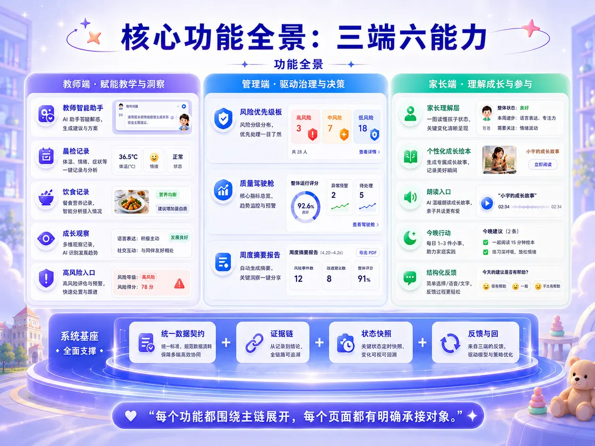
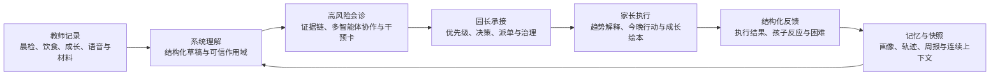
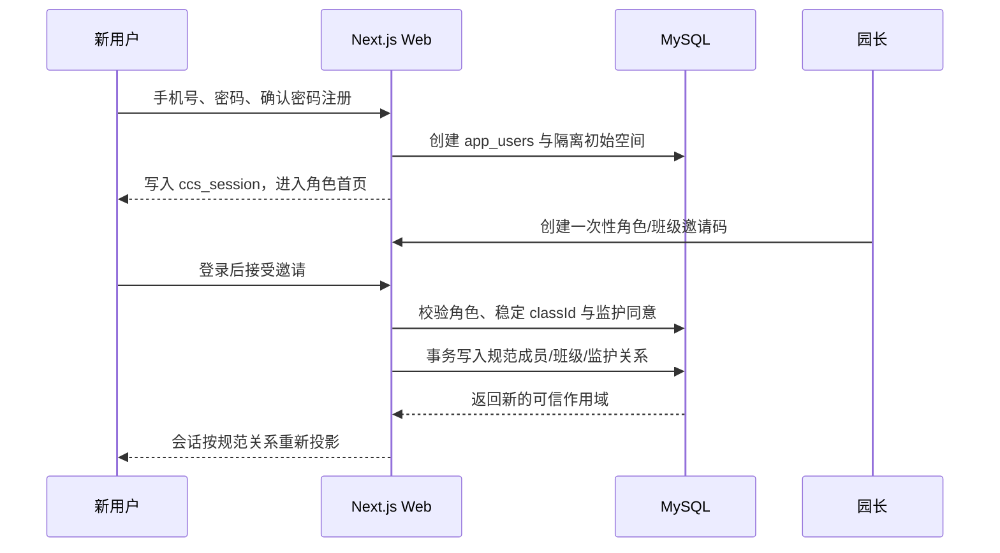
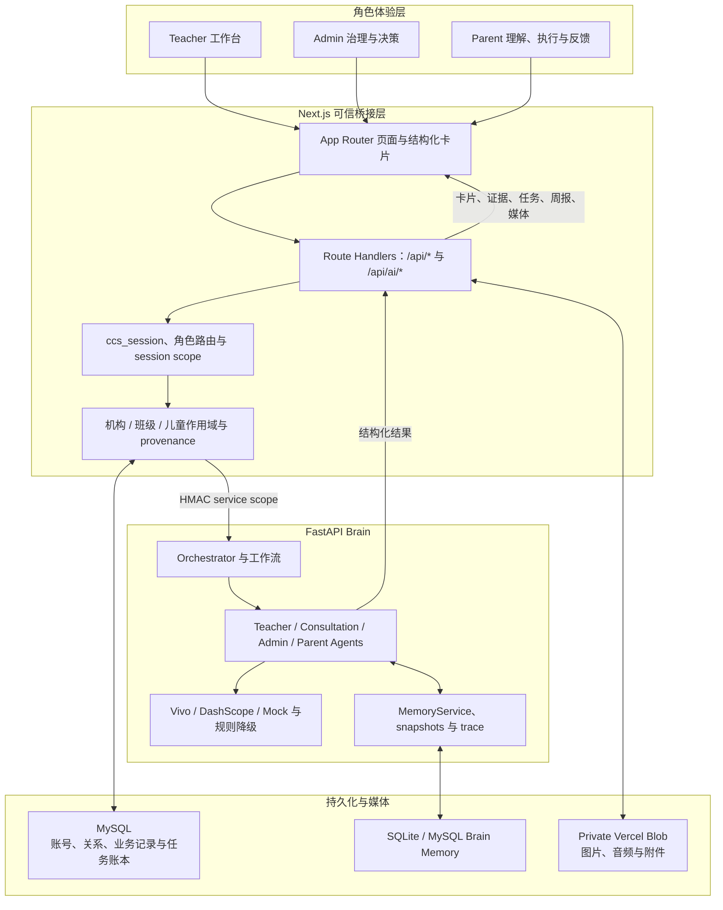

# 慧育童行 - SmartChildcare Agent

> 面向托育场景的多角色、多智能体、移动端优先闭环决策系统。

慧育童行把教师记录、AI 会诊、园长决策、家长理解与执行反馈组织成一条可演示、可复验、可继续生产化的托育协作链路。系统不以“再做一个聊天框”为目标，而是让观察、判断、行动、反馈与下一轮决策能够持续衔接。

<p align="center">
  <a href="https://www.smartchildcare.cn">在线站点</a> ·
  <a href="https://www.smartchildcare.cn/api/health">生产健康接口</a> ·
  <a href="./public/demo/huiyu-tongxing.pdf">系统导览 PDF</a> ·
  <a href="./docs/current-status-ledger.md">当前状态账本</a> ·
  <a href="./docs/competition-message-guide.md">统一展示口径</a>
</p>



> README 与公开演示中出现的人物、儿童档案、业务记录、表单内容、图片和音频均为合成的 demo-safe 数据，仅用于说明产品流程，不对应任何真实儿童、监护人、教师或托育机构。

## 目录

- [一分钟了解项目](#一分钟了解项目)
- [当前状态](#当前状态)
- [核心业务闭环](#核心业务闭环)
- [三角色能力](#三角色能力)
- [真实账号与机构绑定](#真实账号与机构绑定)
- [系统架构](#系统架构)
- [安全与可信边界](#安全与可信边界)
- [技术栈](#技术栈)
- [仓库结构](#仓库结构)
- [本地快速启动](#本地快速启动)
- [环境变量](#环境变量)
- [数据库准备](#数据库准备)
- [测试与发布门禁](#测试与发布门禁)
- [部署说明](#部署说明)
- [演示路线与素材](#演示路线与素材)
- [文档索引](#文档索引)
- [已知边界](#已知边界)
- [许可证](#许可证)

## 一分钟了解项目

SmartChildcare Agent 围绕同一名儿童，把三类角色放进同一条工作流：

- 教师负责捕捉晨检、饮食、成长、语音观察和现场风险信号。
- 系统把碎片输入整理为结构化记录、会诊证据、干预卡、任务和周报。
- 园长承接机构级风险优先级、决策、派单、质量治理和复盘。
- 家长接收易理解的趋势解释、今晚行动和成长绘本，并提交结构化反馈。
- 反馈重新进入儿童画像、状态快照、会诊和周报，成为下一轮判断的上下文。

项目的核心差异不是某个单独的 AI 页面，而是四个工程事实：

1. **多角色协同**：Teacher、Admin、Parent 各自拥有与职责匹配的工作台和权限边界。
2. **结构化承接**：AI 输出被收敛为证据、行动、任务、周报、媒体和反馈，而不是只保留自由文本。
3. **连续记忆**：儿童画像、状态快照、轨迹和反馈支撑连续判断。
4. **可验证边界**：live provider、规则降级、demo 数据和正式发布证据被明确区分。

## 当前状态

更新基准：`2026-07-28`

| 范围 | 当前结论 | 证据入口 |
| --- | --- | --- |
| Web 生产站 | 在线；健康接口返回 `production`，并公开当前部署提交、部署 ID 及数据库、认证、私有媒体、DashScope 配置存在性 | [`/api/health`](https://www.smartchildcare.cn/api/health) |
| 三角色生产业务链 | 现有账号与 fresh 账号两条真实浏览器链路已完成生产 smoke；园长、教师、家长业务写入、跨端读取和 live AI 主链均有通过记录 | [当前状态账本](./docs/current-status-ledger.md) |
| 绘本媒体 | 最近一次生产 smoke 中，fresh 链路首 4 页图片与音频均完成 `private_blob` 冷读，并通过 WebP/WAV 文件魔数验证 | [任务账本](./docs/task-registry.md) |
| 教师成长绘本 | `/teacher/storybook` 的生产功能闭环已验证：已有账号与 fresh 账号均完成教师生成、媒体补全和保存，家长按监护授权读取同一绘本及私有媒体；本轮为非 formal smoke，正式发布证据仍待补齐 | [教师绘本任务记录](./docs/task-registry.md#teacher-storybook-generation-extension) |
| 本地工程验证 | 最近一轮账本记录包含 lint、typecheck、production build、Node/Python 测试、发布脚本测试与浏览器回归 | [当前状态账本](./docs/current-status-ledger.md) |
| 正式发布证明 | **尚未完成**。当前只可声明“生产业务与 live AI smoke 已通过”，不能声明 `productionValidated=true` | [发布门禁真实性](./docs/release/RELEASE_GATE_TRUTHFULNESS.md) |
| 严格生产数据库证据 | 仍需在不暴露连接串的受控环境运行严格 `npm run db:check` 并生成新鲜签名证据 | [任务账本](./docs/task-registry.md) |

生产健康接口是动态事实源。README 不冻结 deployment ID；需要判断当前线上版本时，请直接检查该接口返回的完整 `commitSha` 与 `deploymentId`。其中 capability 布尔值只表示关键配置是否存在，不代表数据库或 provider 的实时调用一定成功。

## 核心业务闭环



这条闭环决定了项目的设计原则：

- 观察不是终点，必须能够进入判断。
- 判断不是终点，必须能够落成角色动作。
- 家长接收不是终点，执行结果必须能够回流。
- AI 结果不是天然可信事实，必须保留来源、作用域、质量与降级状态。

## 三角色能力

### Teacher 教师端

教师端强调低负担记录、快速确认和后续跟进。

- 教师工作台、班级出勤、晨检、饮食、成长、待办和家园沟通概览。
- 晨检、饮食、成长等业务记录的创建、更新、归档与跨端读取。
- 语音理解、OCR/健康材料解析、结构化草稿和 Teacher Copilot。
- 高风险会诊发起、SSE 阶段流、证据链、干预卡与 48 小时复查。
- 成长绘本工作台允许教师在同机构、已分班的授权范围内选择幼儿，基于真实成长记录生成并保存绘本；图片和音频状态写回同一服务端记录，供授权家长读取。
- 全局搜索、通知、消息和账号菜单均读取当前登录作用域内的数据。

主要入口：

| 路由 | 用途 |
| --- | --- |
| `/teacher` | 教师工作台与记录入口 |
| `/teacher/agent` | Teacher Agent、草稿确认与周报预览 |
| `/teacher/storybook?child=c-1` | 为已授权幼儿生成、补全媒体并保存成长绘本 |
| `/teacher/high-risk-consultation` | 高风险会诊、证据链与干预建议 |
| `/teacher/health-file-bridge` | 健康材料上传与解析入口 |
| `/health`、`/diet`、`/growth` | 晨检、饮食与成长记录 |

### Admin 园长端

园长端强调机构级优先级、承接责任和质量治理。

- 园所运营总览、风险优先级、会诊承接、决策卡和派单。
- 教师管理、机构统计、质量治理指标与行动化周报。
- 创建角色和班级受限的一次性机构邀请码。
- 查看机构作用域内的任务、消息、通知、记录和会诊进展。
- 通过稳定 `classId` 和规范成员关系管理教师、班级、儿童与家长授权。

主要入口：

| 路由 | 用途 |
| --- | --- |
| `/admin` | 园长首页、风险优先级和治理区 |
| `/admin/agent` | 园长 Agent、会诊承接与派单 |
| `/admin/agent?action=weekly-report` | 机构周报补充演示路线 |
| `/admin/teachers` | 教师管理 |

### Parent 家长端

家长端强调“看得懂、做得到、愿意反馈”。

- 家长首页、孩子状态、趋势解释、今晚行动、提醒和家庭周报。
- 关怀模式、统一意图入口与更短的家庭执行链路。
- 个性化成长绘本按监护授权读取教师保存的同一份服务端记录，支持文本、图片、音频、媒体状态、持久化，以及本地/受控分享与导出入口；生产级公开外链和 PDF 交付仍受已知边界约束。
- 结构化反馈记录执行状态、次数、执行者、孩子反应、改善情况和困难。
- 首次儿童建档前完成最小必要信息与监护人同意。
- 无权访问的 `childId` 会被明确拒绝，不会自动回退到其他儿童。

主要入口：

| 路由 | 用途 |
| --- | --- |
| `/parent` | 家长首页、今晚行动与周报入口 |
| `/parent/agent?child=c-1` | 趋势解释、追问和结构化反馈 |
| `/parent/storybook?child=c-1` | 个性化成长绘本 |
| `/parent/reminders` | 家庭提醒 |
| `/parent/onboarding/child` | 儿童建档与监护同意 |

## 真实账号与机构绑定

真实注册与加入正式机构是两个独立阶段。



关键规则：

- 注册只创建账号及其隔离的机构、教师或家庭初始空间，不会自动加入其他托育机构。
- 登录兼容手机号与旧用户名账号；密码使用带盐 `scrypt` 哈希。
- 登录态沿用 12 小时 HMAC `ccs_session` HttpOnly Cookie。
- 园长邀请码是一次性的，并绑定目标角色；教师邀请可进一步绑定稳定班级 ID。
- 家长迁入儿童和历史记录前，必须通过监护授权、服务条款与儿童隐私同意校验。
- 规范授权关系存放在 `institution_memberships`、`teacher_class_assignments`、`child_registry`、`guardian_child_links`；`app_users` 中的旧机构、班级和 `child_ids` 只保留兼容投影。
- 教师和儿童都具备 `classId` 时，授权必须按稳定 ID 判断；同名班级不能作为权限依据。

## 系统架构



### 分层职责

| 层级 | 主要职责 |
| --- | --- |
| 角色体验层 | 为教师、园长、家长提供不同的信息密度、操作路径和承接对象 |
| Next.js 页面与 API | 处理会话、业务 CRUD、页面渲染、AI 桥接、媒体读取和浏览器侧交互 |
| 可信作用域层 | 从服务端会话重建机构、班级、儿童与角色范围，不信任浏览器自报的 provider 或 scope |
| FastAPI Brain | 编排 Teacher、会诊、Parent、周报、治理、多模态和记忆工作流 |
| Provider 层 | 接入 Vivo、DashScope，并在允许的开发/演示场景提供显式 mock 或规则降级 |
| 数据与媒体层 | MySQL 保存账号、规范关系和业务事实；Brain memory 保存连续上下文；私有 Blob 保存媒体 |

## 安全与可信边界

### 会话与授权

- `ccs_session` 使用 HMAC-SHA256 签名，生产环境启用 `Secure`，同时设置 `HttpOnly` 与 `SameSite=Lax`。
- 服务端从会话和规范关系表构造可信作用域；前端提交的 `institutionId`、`classId`、`childId` 只能作为待校验输入。
- 业务读取与写入按角色、机构、班级和儿童范围投影。
- 家长无权儿童链接、跨角色缓存切换和远端状态失败均有显式处理。

### AI 结果与服务间调用

- 浏览器只调用 Next.js `/api/ai/*`，不直接进入受信任的 Brain 执行面。
- 非 `development` 环境中，Next.js 与 FastAPI 必须配置相同的 `BRAIN_INTERNAL_SHARED_SECRET`。
- FastAPI 的 agents/memory 路由校验路径、时间戳和作用域签名；缺少共享密钥时 fail closed。
- 可持久化 AI 结果需要服务端 provenance attestation，绑定用户、机构、能力、儿童/班级和结果摘要。
- 客户端自报的 `provider`、`model` 或 `live=true` 不能直接升级为可信 live AI 事实。

### 上传、媒体与语音

- 上传执行流式大小限制、严格 Base64、MIME 白名单与文件魔数一致性检查。
- 图片、音频和附件通过私有 Blob 或受控数据库记录读取，不把私有存储地址当公开静态资源。
- 需要确认的语音写操作使用短期签名令牌，并在数据库中原子消费，防止跨实例重放。
- 绘本媒体任务使用稳定作用域键、任务账本、精确回读和幂等恢复，避免超时后重复付费生成。

更完整的审计见 [租户隔离审计](./docs/security/tenant-isolation-audit.md)。

## 技术栈

| 模块 | 技术 |
| --- | --- |
| Web | Next.js `16.1.6`、React `19.2.3`、TypeScript、App Router |
| 样式与组件 | Tailwind CSS 4、Radix UI、Lucide、Sonner |
| 数据可视化 | Recharts |
| Next.js 服务端 | Route Handlers、Node.js runtime、`mysql2` |
| Brain | FastAPI、Uvicorn、Pydantic 2、httpx、WebSocket |
| 应用数据库 | MySQL；账号、规范关系、业务记录、状态快照和任务账本 |
| Brain Memory | 本地 SQLite 或 MySQL/`aiomysql` |
| AI Provider | Vivo、DashScope；开发/演示环境可显式使用 mock 或规则降级 |
| 私有媒体 | Vercel Blob private store |
| 测试 | Node Test、Pytest、Playwright |
| 部署配置 | Vercel Web；FastAPI Dockerfile、Docker Compose、Caddy staging runbook |

> `supabase/sql/` 是历史目录名，其中 DDL 使用 **MySQL 方言**；README 不把它描述成 Supabase/PostgreSQL 运行时。

## 仓库结构

```text
childcare-smart/
├─ app/                         # Next.js 页面、角色入口与 Route Handlers
│  ├─ admin/                    # 园长端
│  ├─ teacher/                  # 教师端，含 /teacher/storybook 绘本生成工作台
│  ├─ parent/                   # 家长端，含授权绘本读取与反馈
│  └─ api/                      # 认证、业务、AI、媒体与状态 API
├─ components/                  # 角色页面、结构化卡片、全局工具中心
├─ lib/                         # 认证、作用域、业务服务、AI contract 与客户端 store
├─ backend/
│  ├─ app/                      # FastAPI Brain、agents、services、providers、memory
│  ├─ tests/                    # Python 测试
│  ├─ requirements.txt
│  └─ Dockerfile
├─ shared/                      # TypeScript / Python 共用策略与静态 contract
├─ supabase/sql/                # MySQL 基础表与受控迁移脚本
├─ scripts/                     # smoke、发布门禁、数据库预检与演示素材工具
├─ tests/                       # Playwright 产品、功能、发布与视觉回归
│  └─ fixtures/                 # 测试夹具与 frontend-replica Page Specs
├─ public/demo/                 # 系统导览 PDF 与当前 v3 展示图
├─ public/demo-media/           # demo-safe 绘本和多媒体资产
├─ docs/                        # 当前文档总览、事实账本与分类文档
│  ├─ auth/ demo/ qa/ release/ security/
│  └─ pixel-replica/            # 当前视觉复刻规则与验收入口
├─ .env.example                 # 根环境变量模板；不含真实密钥
├─ package.json
└─ docker-compose.yml
```

## 本地快速启动

### 1. 前置要求

- Node.js `>= 20.9`，推荐使用当前 LTS 或更新版本。
- npm，依赖安装优先使用锁文件对应的 `npm ci`。
- Python `3.11+`；后端 Docker 镜像使用 Python `3.13`。
- 如需真实账号与真实业务数据，准备 MySQL。
- 如需浏览器测试，安装 Playwright Chromium。

### 2. 克隆并安装依赖

```powershell
git clone https://github.com/VictorMaxWang/childcare-smart.git
Set-Location .\childcare-smart

npm ci

py -m venv .\backend\.venv
.\backend\.venv\Scripts\python.exe -m pip install --upgrade pip
.\backend\.venv\Scripts\python.exe -m pip install -r .\backend\requirements.txt

Copy-Item .\.env.example .\.env.local
```

浏览器测试首次使用时：

```powershell
npx playwright install chromium
```

### 3. 配置最小本地环境

先生成随机 session secret：

```powershell
node -e "console.log(require('node:crypto').randomBytes(32).toString('hex'))"
```

至少在未跟踪的 `.env.local` 中填写：

```dotenv
AUTH_SESSION_SECRET=替换为上一步生成的随机值
BRAIN_API_BASE_URL=http://127.0.0.1:8000
BRAIN_PROVIDER=mock
ENABLE_MOCK_PROVIDER=true
```

开发模式允许显式 mock/规则降级，适合先体验 demo；它不代表真实数据库、live AI 或正式发布门禁已经通过。

### 4. 启动 FastAPI Brain

打开第一个 PowerShell：

```powershell
.\backend\.venv\Scripts\python.exe -m uvicorn app.main:app `
  --app-dir backend `
  --host 127.0.0.1 `
  --port 8000
```

Brain 健康检查：

```text
http://127.0.0.1:8000/api/v1/health
```

### 5. 启动 Next.js

打开第二个 PowerShell：

```powershell
npm run dev
```

访问：

- Web：`http://localhost:3000`
- 登录页：`http://localhost:3000/login`
- Web 健康接口：`http://localhost:3000/api/health`

登录页提供示例账号入口。真实账号注册、真实 AI 和私有媒体需要继续配置数据库与 provider。

## 环境变量

完整模板位于：

- [`.env.example`](./.env.example)
- [`.env.release.example`](./.env.release.example)
- [`backend/.env.example`](./backend/.env.example)
- [`backend/.env.release.example`](./backend/.env.release.example)

下面只列最重要的分组。真实密码、Cookie、API Key 和连接串只能放在未跟踪 env 文件或部署平台 secrets 中。

| 分组 | 关键变量 | 说明 |
| --- | --- | --- |
| Web 认证与数据库 | `AUTH_SESSION_SECRET`、`DATABASE_URL`、`DATABASE_SSL` | 真实账号、会话与 MySQL 业务数据 |
| 私有媒体 | `BLOB_READ_WRITE_TOKEN` | 私有图片、音频与附件；生产媒体链需要 |
| Next → Brain | `BRAIN_API_BASE_URL`、`BRAIN_INTERNAL_SHARED_SECRET`、`BRAIN_API_TIMEOUT_MS` | 非开发环境两端必须共享同一 secret |
| Brain 运行模式 | `ENVIRONMENT`、`ALLOW_ORIGINS`、`ENABLE_MOCK_PROVIDER`、`BRAIN_PROVIDER` | 控制环境、CORS 与 provider 选择 |
| Brain Memory | `BRAIN_MEMORY_BACKEND`、`BRAIN_MEMORY_SQLITE_PATH`、`MYSQL_URL` | 本地 SQLite 或 MySQL memory |
| Vivo | `VIVO_APP_ID`、`VIVO_APP_KEY`、`VIVO_BASE_URL`、`VIVO_LLM_MODEL`、ASR/TTS 相关变量 | 只在服务端配置 |
| DashScope | `DASHSCOPE_API_KEY`、`BAILIAN_*`、`NEXT_STORYBOOK_IMAGE_PROVIDER`、`STORYBOOK_DASHSCOPE_*` | 文本、OCR、视觉与绘本图片能力 |
| 发布门禁 | `RELEASE_*`、`REAL_SMOKE_*`、现有三角色账号凭据 | 仅用于受控发布环境 |

特别说明：

- `DATABASE_URL` 只接受 `mysql://` 或 `mysqls://`。
- `AUTH_REGISTER_ENABLED` 当前由真实注册 smoke 做前置校验，**不是可依赖的运行时注册开关**。
- 不要创建或提交任何 `NEXT_PUBLIC_VIVO_*`；provider 密钥不能暴露给浏览器。
- 配置 VPS/Brain 的 `VIVO_*` 不等于 Vercel 上的 Next.js AI 路由已经完成同样配置，两者是独立配置面。

## 数据库准备

项目没有 Alembic、Prisma 或自动 migration runner。SQL 必须在确认目标数据库和依赖顺序后，由受控环境人工应用。

### 基础与关键迁移

| 范围 | 主要脚本 |
| --- | --- |
| 账号与状态 | `supabase/sql/app_users.sql`、`supabase/sql/app_state_snapshots.sql` |
| 手机号与监护同意 | `supabase/sql/20260704_add_phone_normalized_to_app_users.sql`、`supabase/sql/20260704_create_consent_records.sql` |
| 正式机构关系 | `supabase/sql/20260724_create_institution_memberships.sql` |
| 绘本媒体 | `supabase/sql/20260724_create_storybook_media_assets.sql`、`supabase/sql/20260726_create_storybook_media_tasks.sql` |
| 通知与 ASR 任务 | `supabase/sql/20260725_create_admin_notification_events.sql`、`supabase/sql/20260726_create_vivo_asr_tasks.sql` |
| 语音确认防重放 | `supabase/sql/20260726_create_voice_confirmation_token_consumptions.sql` |
| Brain MySQL Memory | `supabase/sql/agent_memory_hub.sql` |

注意：

- 不要对生产库盲目重复执行全部脚本。
- `20260704_add_phone_normalized_to_app_users.sql` 不是可无条件重复执行的幂等迁移。
- 未执行机构关系迁移的环境会回退旧授权字段，不具备正式邀请绑定能力。
- 生产缺少语音确认消费表时，需要确认的语音写操作会被拒绝，不能降级到单实例内存锁。

完成受控迁移后，运行只读预检：

```powershell
npm run db:check
```

`db:check` 检查真实业务所需的表、列和关键索引，不写数据，也不会输出完整连接串。

## 测试与发布门禁

### 基础质量检查

```powershell
npm run lint
npm run typecheck
npm run test:node
npm run test:python
npm run build
```

### 安全与重点功能

```powershell
npm run test:session-security
npm run test:auth-register
npm run test:auth-phone
npm run test:security-permission
npm run product:smoke
npm run product:ai
npm run product:voice
npm run product:journey
```

### 本地浏览器与开发门禁

```powershell
npm run test:browser:release:local
npm run release:gate:local
```

本地 opt-out 允许明确跳过需要真实账号的规格；报告会标记 `[LOCAL-ONLY]`，不能据此声明生产已验证。

### 真实数据库 smoke

```powershell
npm run auth:smoke
```

`auth:smoke` 会在确认过的真实数据库中创建测试数据；正常完成时会尝试清理并验证清理结果。进程异常中断、数据库连接中断或启用 `AUTH_SMOKE_KEEP_DATA` 时可能保留测试数据。运行前必须核对 `DATABASE_URL`，并准备：

- `DATABASE_URL`
- `DATABASE_SSL`
- `AUTH_SESSION_SECRET`
- `AUTH_REGISTER_ENABLED=true`
- `BRAIN_API_BASE_URL`
- `BRAIN_INTERNAL_SHARED_SECRET`

如启用保留数据选项，测试数据不会自动清理；不要在不理解目标库和选项的情况下运行。

### 正式发布门禁

唯一权威入口是从干净宿主直接启动 PowerShell：

```powershell
powershell -NoProfile -ExecutionPolicy Bypass `
  -File .\scripts\release-formal-gate.ps1 `
  -EnvFile .env.release
```

正式门禁要求同一次运行中的完整 SHA、签名报告、固定 deployment origin、严格 SQL 证据、非跳过浏览器测试，以及现有/fresh 三角色真实账号 live AI 链路。

`npm run release:go:all` 只用于发现命令，不是敌对宿主环境下的权威发布证明。完整规则见 [发布门禁真实性](./docs/release/RELEASE_GATE_TRUTHFULNESS.md)。

## 部署说明

### Web

- 生产 Web 当前运行在 Vercel。
- `/api/health` 暴露当前提交、deployment ID 和关键能力配置存在性，便于核对“代码提交”和“实际部署”是否一致；它不是数据库或 provider 的实时可用性探针。
- 仓库没有跟踪的 `.github/workflows` 或 `vercel.json`，因此 README 不宣称 GitHub Actions CI/CD 已配置；Vercel 项目绑定属于平台外部状态。

### FastAPI Brain

仓库提供：

- [`backend/Dockerfile`](./backend/Dockerfile)
- [`docker-compose.yml`](./docker-compose.yml)
- [`Caddyfile`](./Caddyfile)
- [腾讯云 VPS staging runbook](./docs/release/deployment-vps.md)

Docker Compose 拓扑用于 FastAPI backend + Caddy staging，读取根目录未跟踪的 `.env.release`，并通过 `/data` 持久卷保存本地 memory。该拓扑是部署配置和 runbook，不应被扩写成未经核验的当前生产事实。

### 部署时必须保持

- Vercel/Next.js 与 FastAPI 是两个独立环境变量配置面。
- 两端的 `BRAIN_INTERNAL_SHARED_SECRET` 必须一致。
- 生产 provider 密钥只放服务端。
- Web 健康、Brain 健康、数据库预检和三角色真实浏览器链路需要分别验收。
- 只有正式 PowerShell 门禁的同次签名证据可以给出正式发布结论。

## 演示路线与素材

推荐按下面顺序体验：

1. `/login`：品牌首屏、示例账号与系统导览。
2. `/teacher`：教师工作台、记录与语音/草稿入口。
3. `/teacher/storybook?child=c-1`：教师为授权幼儿生成、补全媒体并保存成长绘本。
4. `/teacher/high-risk-consultation`：高风险会诊、证据链与干预卡。
5. `/admin`：风险优先级、会诊承接、治理区与周报预览。
6. `/parent`：今晚行动、趋势入口、关怀模式与反馈入口。
7. `/parent/storybook?child=c-1`：家长读取教师保存的同一份成长绘本。
8. `/parent/agent?child=c-1`：趋势追问与结构化反馈。

`/teacher/agent` 与 `/admin/agent?action=weekly-report` 作为补充路线。

### 演示素材命令

```powershell
npm run system-tour:images
npm run capture:ui
npm run demo:preflight
npm run demo:materials
npm run demo:materials:capture
npm run demo:video-storyboard
```

- `demo:materials` 打包已有截图、系统导览、preflight 与架构素材。
- `demo:materials:capture` 会重新采集页面，运行前应确认目标 URL、账号和脱敏策略。
- 输出主要位于已忽略的 `artifacts/demo-materials/`，详见 [演示素材说明](./docs/demo/demo-materials.md)。运行采集命令前必须使用合成 demo 数据，并检查截图、网络日志和导出包中没有账号凭据或真实个人信息。

<table>
  <tr>
    <td width="50%">
      
    </td>
    <td width="50%">
      
    </td>
  </tr>
  <tr>
    <td align="center">系统导览封面</td>
    <td align="center">个性化成长绘本 demo-safe 示例</td>
  </tr>
</table>

## 文档索引

完整导航和当前事实源边界见 [文档总览](./docs/README.md)。阶段性提示词、状态表、执行日志和生成报告不再进入当前文件树；历史材料可通过 Git 提交追溯，可再生成产物统一写入已忽略的 `artifacts/`。

### 当前事实与比赛口径

- [当前状态账本](./docs/current-status-ledger.md)
- [任务账本](./docs/task-registry.md)
- [比赛架构总说明](./docs/competition-architecture.md)
- [比赛统一口径](./docs/competition-message-guide.md)

### 认证、数据与安全

- [认证注册下一阶段说明](./docs/auth/auth-registration-next-phase.md)
- [真实数据库注册任务清单](./docs/tasks/registration-real-db-tasklist.md)
- [租户隔离审计](./docs/security/tenant-isolation-audit.md)

### 发布与部署

- [发布门禁真实性](./docs/release/RELEASE_GATE_TRUTHFULNESS.md)
- [VPS staging 部署与修复](./docs/release/deployment-vps.md)

### 演示与 QA

- [演示素材说明](./docs/demo/demo-materials.md)
- [教师高风险会诊 QA](./docs/qa/teacher-consultation-qa.md)
- [教师语音 Smoke](./docs/qa/teacher-voice-smoke.md)
- [家长趋势 Smoke](./docs/qa/parent-trend-smoke.md)

### 开发协作

新线程或贡献者应按以下顺序阅读：

1. [`docs/README.md`](./docs/README.md)
2. [`docs/current-status-ledger.md`](./docs/current-status-ledger.md)
3. [`docs/competition-architecture.md`](./docs/competition-architecture.md)
4. [`docs/task-registry.md`](./docs/task-registry.md)
5. [`AGENTS.md`](./AGENTS.md)

代码事实始终高于旧文档描述。遇到 dirty worktree 时，不要回滚或顺手提交他人的在途改动。

## 已知边界

以下内容不能因为 demo、代码接入或单次 smoke 成功而被写成“已经完整生产化”：

- 真实短信验证码、密码找回和完整账号生命周期仍未完成。
- 完整隐私合规运营、正式审计、长期监控、灾备、SLA 与真实机构规模化验收仍需继续建设。
- Vivo/DashScope 的代码接入与 smoke 记录不等于所有上游能力长期稳定。
- Provider 未配置、不可用或超时时，部分链路会显式进入 mock、规则降级或 unavailable；降级结果不能标记为 live AI。
- 正式签名发布门禁与严格生产数据库证明仍待受控环境补齐。
- 生产功能 smoke 已验证教师生成、保存与家长读取同一成长绘本，但本轮没有运行 formal gate，因此不能据此宣称正式发布证明已经完成。
- 所有人物、儿童档案、业务记录、表单、图片、音频、demo 数据、系统导览和绘本示意图均为合成展示材料，不能作为真实儿童或真实机构业务事实。
- Brain MySQL memory 的物理表仍需继续强化机构维度；当前主要依赖签名后的 child scope 与服务端作用域隔离。

## 许可证

仓库代码采用 [MIT License](./LICENSE) 开源。第三方依赖与第三方素材仍分别遵循其原始许可证和使用条款。

---

- 项目展示名：**慧育童行**
- 英文名 / 技术系统名：**SmartChildcare Agent**
